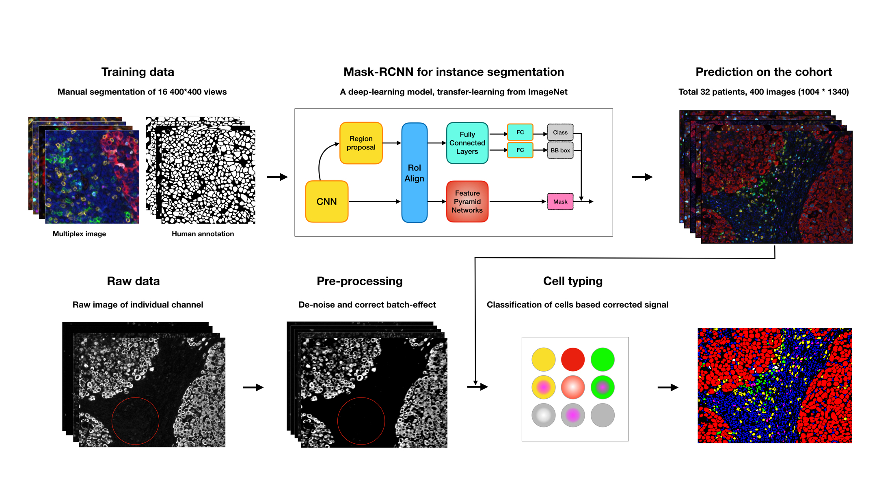

# Vectra Imaging Processing Pipeline

Multiplexed imaging data is providing dramatic opportunities to understand the tumor microenvironment, but there is an acute need for better analysis tools. Here, we provide a pipeline for multiplexed imaging quality control and processing. It contains three core steps: 

1. Preprocess raw images to remove undesired noise (introduced by technical sources) while retaining biological signal  
2. Perform segmentation to draw boundaries around individual cells, making it possible to discern morphology and which features, such as detected RNA or protein, belong to each cell.  
3. Extract cellular feature from images via segmentation and assign cell types to each cell. 

To transform digital images into cell-level measurements, we have been applying, comparing and optimizing cutting-edge computer vision and machine learning techniques to each of the steps above. All code is written in Python.


## Quick Start 

### Dependencies

* Clone this repository

* Create a new conda environment for this pipeline 

* ```bash
  conda env create -n davinci -f environment.yml 
  source activate davinci
  python -m ipykernel install --user --name davinci
  ```
  
* Install this package

* ```bash
  python setup.py install
  ```

* Install the deep learning model for segmentation following the instruction on [link](https://github.com/dpeerlab/Mask_R-CNN_cell)

### Usage

Step-by-step tutorial on the usage can be found in the following Jupiter notebooks:

#### 0. Data inspection

* Image file inspection [Notebook](./notebook/0.1.Image_file_inspection.ipynb)
* Image data inspection [Notebook](./notebook/0.2.Image_data_inspection.ipynb)
* Image visualization  [Notebook](./notebook/0.3.Image_visualization.ipynb)

#### 1. Preprocessing 

* Image preprocessing  [Notebook](./notebook/1.1.Image_preprocessing.ipynb)
* Image QC report  [Notebook](./notebook/1.2.Image_QC_report.ipynb)

#### 2. Segmentation 

* Train deep learning model on custom data [Notebook](./notebook/2.1.Image_segmentation_train.ipynb)
* Predict segmentation with pre-trained model [Notebook](./notebook/2.2.Image_Segmentation_prediction.ipynb)

#### 3. Cell typing

* Cell feature extraction [Notebook](./notebook/3.1.Cell_feature_extraction.ipynb)
* Cell typing [Notebook](./notebook/3.2.Cell_typing.ipynb)

## Workflow



## Future plan

- [ ] Integrate all pipeline functions into a package 
- [ ] Provide more pre-trained weights for segmentation using different marker panels 

## Note

 * The data in this repo are for demonstration only. Please do not use them for any other purposes.

## Acknowledgement 

This work is supported by [Parker Institute for Cancer Immunotherapy](https://www.parkerici.org/)


## Reference

He, K., G. Gkioxari, P. Dollár, and R. Girshick. 2017. “Mask R-CNN.” In *2017 IEEE International Conference on Computer Vision (ICCV)*, 2980–88. [link](https://arxiv.org/abs/1703.06870)
