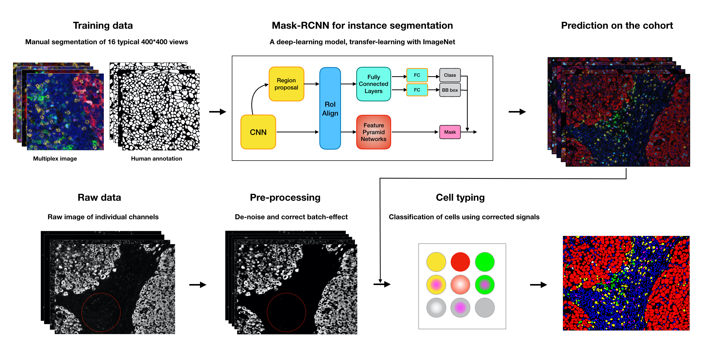

# Vectra Imaging Processing Pipeline

Multiplex imaging data is providing dramatic opportunities to understand the tumor microenvironment, but there is an acute need for better analysis tools. Here we provide a pipeline for multiplexed imaging quality control and processing. It contains three core steps: 

First, preprocess raw images to remove undesired noise (introduced by technical sources) while retaining biological signal. Next, perform segmentation to draw boundaries around individual cells, making it possible to discern morphology and which features, such as detected RNA or protein belong to each cell. Finally, extract cellular feature from images via segmentation and assign cell types to each cell.  We have been working on each of these steps, applying, comparing and optimizing cutting-edge computer vision and machine learning techniques to transform digital images into cell-level measurements. All the codes are wroten in Python.


## Quick Start 

### Dependencies

* Clone this repository

  ```bash
  git clone https://github.com/dpeerlab/Vectra_Imaging_pipeline.git
  ```

* Create a new conda environment for this pipeline 

* ```bash
  conda env create -n vinci -f environment.yml 
  ```

* Create another conda environment for deep learning model following the instruction on [link](https://github.com/dpeerlab/Mask_R-CNN_cell)


### Usage

Step by step tutorial on the usage can be found in the following list of Jupiter notebooks.

#### 0. Data inspection

* Image file inspection
* Image data inspection
* Image visualization 

#### 1. Preprocessing 

* Image preprocessing 
* Image QC report 

#### 2. Segmentation 

* Train deep learning model on custom data
* Predict segmentation with pre-trained model

#### 3. Cell typing

* Cell feature extraction
* Cell typing

## Workflow



## Future plan 

- [ ] Integrate all the functions from the pipeline into a package 
- [ ] Provide more pre-trained weights for segmentation task on different marker panel 


## Acknowledgement 

This work is supported by [Parker Institute for Cancer Immunotherapy](https://www.parkerici.org/)


## Reference

He, K., G. Gkioxari, P. Dollár, and R. Girshick. 2017. “Mask R-CNN.” In *2017 IEEE International Conference on Computer Vision (ICCV)*, 2980–88. [link](https://arxiv.org/abs/1703.06870)


